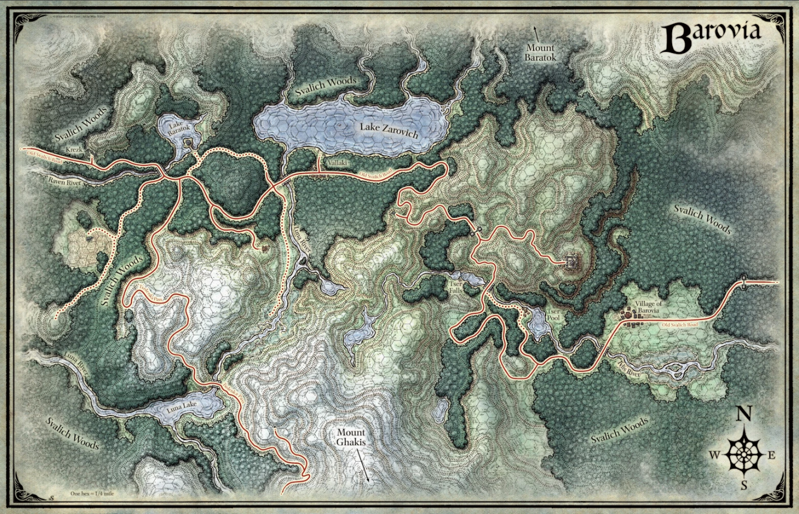

Thought it would be cool to make a little site for the notes.

---

  

    <h2>🗺️ Locations</h2>
    
Explore towns, castles, dungeons, and more.

    <ul>
      <li><a href="https://kellemesdnd.github.io/barovia-valr-wiki.github.io/Location/Camp/">Camps</a></li>
      <li><a href="https://kellemesdnd.github.io/barovia-valr-wiki.github.io/Location/Castle/">Castles</a></li>
      <li><a href="https://kellemesdnd.github.io/barovia-valr-wiki.github.io/Location/Dungeon/">Dungeons</a></li>
      <li><a href="https://kellemesdnd.github.io/barovia-valr-wiki.github.io/Location/House/">Houses</a></li>
      <li><a href="https://kellemesdnd.github.io/barovia-valr-wiki.github.io/Location/Misc/">Misc</a></li>
      <li><a href="https://kellemesdnd.github.io/barovia-valr-wiki.github.io/Location/Region/">Regions</a></li>
      <li><a href="https://kellemesdnd.github.io/barovia-valr-wiki.github.io/Location/Town/">Towns</a></li>
    </ul>
  

  

    <h2>🧙 NPCs & Factions</h2>
    
Keep track of important characters and groups.

    <ul>
      <li><a href="https://kellemesdnd.github.io/barovia-valr-wiki.github.io/NPCs/">NPCs</a></li>
      <li><a href="https://kellemesdnd.github.io/barovia-valr-wiki.github.io/Factions/">Factions</a></li>
    </ul>
  

  

    <h2>⚔️ Quests & Items</h2>
    
Track active quests and important loot.

    <ul>
      <li><a href="https://kellemesdnd.github.io/barovia-valr-wiki.github.io/Quests/">Quests</a></li>
      <li><a href="https://kellemesdnd.github.io/barovia-valr-wiki.github.io/Items/">Items</a></li>
    </ul>
  

  

    <h2>🔮 Tarokka</h2>
    
Fortunes and Strahd’s enemies.

    <ul>
      <li><a href="https://kellemesdnd.github.io/barovia-valr-wiki.github.io/Tarokka/Fortunes/">Fortunes</a></li>
      <li><a href="https://kellemesdnd.github.io/barovia-valr-wiki.github.io/Tarokka/Strahd's Enemies/">Strahd's Enemies</a></li>
    </ul>
  

  

    <h2>🛡️ Party Members</h2>
    
Our adventuring party so far:

    <ul>
      <li>🐇 Lorrent – Harengon Life Cleric</li>
      <li>🗿 Valkar – Goliath War Cleric</li>
      <li>🏹 Marcus – Human Ranger</li>
      <li>🎵 Gonk – Orc Bard</li>
    </ul>
  

  

    <h2>🗺️ Map of Barovia</h2>
    
Areas our party has explored so far.

    
  

